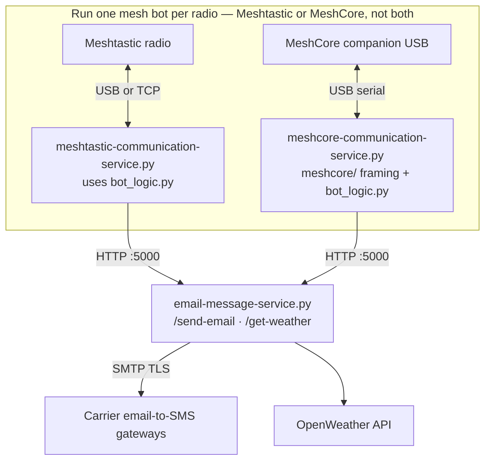

# Mesh-SMS-proxy

A multi-service bridge that lets **Meshtastic** or **MeshCore** mesh users send **SMS-style text messages** to the public cellular network without a dedicated SMS modem. Messages leave the mesh through a small Flask backend that delivers them via each carrier’s **email-to-SMS gateway** (SMTP). The same backend powers optional **weather lookups** for mesh bot commands.

Pick **one mesh stack** on the gateway host (Meshtastic *or* MeshCore companion USB)—both use the same command vocabulary and email backend.

Built for the **Louisiana Mesh Community** ([discord.louisianamesh.org](https://discord.louisianamesh.org)).

---

## What problem it solves

Off-grid or disaster-style mesh networks are great for local coordination, but people outside the mesh still live on phone SMS. Mesh-SMS-proxy closes that gap in one direction (mesh → phone):

1. A user DMs the mesh bot with structured text (`bot: sms …`).
2. The bot forwards the request to a trusted server on the internet.
3. The server emails the recipient’s carrier SMS gateway address (e.g. `5551234567@vtext.com`).
4. The carrier delivers the body as a normal text message.

No Twilio account, no SIM in the server—only SMTP and knowledge of carrier gateway domains. That keeps the bar low for community operators who already have Gmail or another SMTP relay.

The design also records **who sent the message** (node ID / name) and optional **GPS**, so downstream humans can see provenance in the SMS body. The email service tags each send with **`moc`**: `0` = Meshtastic, `1` = MeshCore.

---

## Architecture



| Component | Role |
|-----------|------|
| **`bot_logic.py`** | Shared command parser (`bot: sms`, `bot: weather`, help, etc.) for both stacks. |
| **`meshtastic-communication-service.py`** | Meshtastic client via `meshtastic` Python library (USB serial or TCP). |
| **`meshcore-communication-service.py`** | MeshCore **companion USB** client using vendored `meshcore/` protocol helpers. |
| **`email-message-service.py`** | Flask app: SMTP SMS delivery, OpenWeather proxy, optional IP registration stubs. |

Run **one** mesh bot process per radio. Both bots talk to the same email service on port 5000.

---

## Features

### SMS proxy (DM only)

SMS commands are accepted **only in direct messages** to the bot. Broadcast attempts get a reminder to use DMs.

**Help**

```
bot: sms help
```

**Send format** (comma-separated fields, note the double comma `,,` between fields):

```
bot: sms <phone>,, <yes|no location>,, <carrier>,, <message text>
```

| Field | Description |
|-------|-------------|
| Phone | Destination number (digits as you would dial; no formatting enforced in code). |
| Location | `yes` — attach location if available (Meshtastic: sender’s cached node position; MeshCore: bot’s advertised lat/lon); `no` — omit coordinates. |
| Carrier | One of the supported providers (see below). |
| Message | Free text; included in the SMS body with metadata wrapper. |

**Supported carriers** (email gateway mapping in `email-message-service.py`):

| Provider (user input) | Email gateway pattern |
|----------------------|------------------------|
| `at&t` | `{number}@txt.att.net` |
| `verizon` | `{number}@vtext.com` |
| `t-mobile` / `tmobile` | `{number}@tmomail.net` |
| `google-fi` | `{number}@msg.fi.google.com` |
| `consumer-cellular` / `consumercellular` | `{number}@mailmymobile.net` |

The outbound SMS body is prefixed with Louisiana Mesh branding, **device ID**, **mesh type** (`moc`: `0` = Meshtastic, `1` = MeshCore reserved), and **GPS** when available.

### Weather (DM or broadcast)

```
bot: weather              # uses sender’s cached mesh position
bot: weather 70112        # uses US zip code → geocode → OpenWeather
bot: weather help
```

Temperature is converted from Kelvin to °F in the mesh bot before reply. Weather data is fetched by the email service (`/get-weather`) using an OpenWeather API key from config.

### Community / utility commands

Available in **DM** and on the **primary channel** (except SMS, DM-only):

| Command | Behavior |
|---------|----------|
| `bot: help` | Multi-part help text listing commands. |
| `bot: status` | “Online and listening”. |
| `bot: discord` | Discord invite link. |
| `bot: kofi` | Ko-fi shop link. |
| `ping` | `pong` |
| `:3` | `:3` |

---

## Configuration

### Email / weather service

Copy the example config and fill in secrets (never commit `config.json`—it is gitignored):

```bash
cp config_example.json config.json
```

| Key | Purpose |
|-----|---------|
| `smtp_server` | SMTP host (example uses `smtp.gmail.com`). |
| `smtp_port` | Typically `587` with STARTTLS. |
| `smtp_username` | SMTP login / From address. |
| `smtp_password` | App password or SMTP credential. |
| `openweather_api_key` | OpenWeather API key for `/get-weather`. |
| `email_service_host` | Hostname for mesh bots to reach Flask (default `localhost`). |
| `email_service_port` | Flask port (default `5000`). |
| `meshcore_serial` | Serial device for MeshCore companion USB (e.g. `/dev/ttyACM0`). |

Run the Flask service:

```bash
python3 email-message-service.py
```

Default: Flask debug mode on port **5000**.

### Dependencies

```bash
python3 -m venv venv
source venv/bin/activate
pip install -r requirements.txt
```

### Meshtastic mesh bot

Environment (optional overrides):

| Variable | Default | Meaning |
|----------|---------|---------|
| `MESHTASTIC_USE_SERIAL` | `1` | USB serial; set `0` for TCP. |
| `MESHTASTIC_TCP_HOST` | `localhost` | Meshtastic TCP API host. |
| `EMAIL_SERVICE_HOST` | `localhost` | Flask email service host. |
| `EMAIL_SERVICE_PORT` | `5000` | Flask port. |

```bash
python3 meshtastic-communication-service.py
```

On start it prints the connected node long name and node ID, then listens for packets.

### MeshCore mesh bot

Requires **companion USB** firmware (binary framing), not Room Server text CLI.

| Variable | Default | Meaning |
|----------|---------|---------|
| `MESHCORE_SERIAL` | `/dev/ttyACM0` | USB serial port to the radio. |
| `MESHCORE_BAUD` | `115200` | Serial baud rate. |
| `EMAIL_SERVICE_HOST` | `localhost` | Flask email service host. |
| `EMAIL_SERVICE_PORT` | `5000` | Flask port. |

Or set `meshcore_serial` in `config.json`.

```bash
python3 meshcore-communication-service.py
```

Direct messages are routed using sender label + pubkey prefix (e.g. `AE5TC 326A`). SMS payloads use `moc=1` and include MeshCore identity in the email body.

**Typical gateway layout**

1. `python3 email-message-service.py` (always on, port 5000)
2. **Either** `meshtastic-communication-service.py` **or** `meshcore-communication-service.py` (one radio, one bot)

---

## HTTP API (email service)

| Method | Path | Body | Response |
|--------|------|------|----------|
| `GET` | `/` | — | Plain-text status line. |
| `POST` | `/send-email` | `phone_number`, `message`, `device_id`, `gps_x`, `gps_y`, `moc`, `celluar_provider` | `200` on SMTP success. |
| `POST` | `/get-weather` | `zipcode` (0 = use GPS), `gps_x`, `gps_y` | OpenWeather JSON or error. |
| `POST` | `/connect-meshtastic` | `meshtastic_ip` | Registers client IP (global stub for future use). |
| `POST` | `/connect-meshcore` | `meshcore_ip` | Registers MeshCore client IP (stub for future use). |

Both mesh bots use `/send-email` (with `moc` `0` or `1`) and `/get-weather`.

---

## Location handling

**Meshtastic**

1. Looks up `interface.nodes[sender_id]` for cached `position` (`latitudeI` / `longitudeI`).
2. If missing on weather requests, sends `sendPosition` to the remote node and asks the user for a zip code.

**MeshCore**

1. Uses the **gateway radio’s** advertised lat/lon from companion `SELF_INFO` when location is requested (per-node GPS cache is not implemented yet).
2. Weather without zip: same coordinates, or prompt to use `bot: weather 70112`.

Operators should expect **best-effort** GPS—not real-time tracking.

---

## Security and operations notes

- **One-way bridge:** Mesh → SMS only; replies from the phone do not return to mesh in this codebase.
- **Trust boundary:** Anyone who can DM the bot can attempt to send SMS through your SMTP account. Deploy the mesh bot on a trusted node; restrict Flask to a private network or add authentication (not present today).
- **SMTP abuse:** Rate limiting, allowlists, and logging should be added for production; the reference implementation has none.
- **Secrets:** Keep `config.json` off git; use app-specific SMTP passwords.
- **Carrier limits:** Email-to-SMS gateways often truncate long messages and may delay delivery; behavior varies by carrier.
- **Work in progress:** Help text in the bot states commands are still evolving; report issues in Discord.

---

## Project status

This repository is an **early community tool**, not a polished product:

- Configuration is `config.json` plus environment variables; Flask runs with `debug=True` by default.
- MeshCore per-sender GPS is not implemented (uses gateway advert coordinates).
- Zip-based weather geocoding uses OpenWeather’s geo API with a numeric zip as `q=`—behavior may be imperfect outside supported regions.

The **core idea**: shared `bot_logic.py` command handling, stack-specific mesh adapters, and one SMTP shim to reach phones when the internet is available at the gateway.

---

## License

GNU General Public License v3.0 — see [LICENSE](LICENSE).

---

## Community

**Louisiana Mesh Community**

- Discord: [discord.louisianamesh.org](https://discord.louisianamesh.org)
- Support / stickers: [ko-fi.com/louisianameshcommunity](https://ko-fi.com/louisianameshcommunity/shop)

Built by Lenley Ngo for LMesh (attributed in the email service status string).
